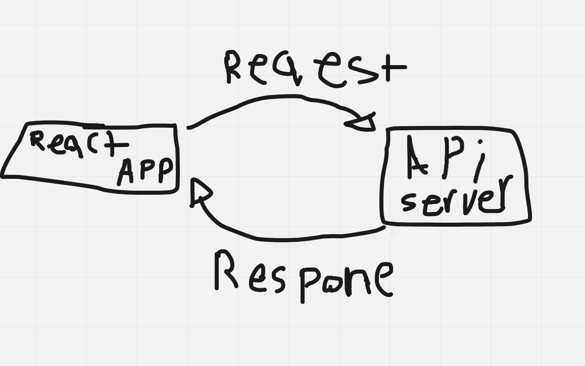

# Weather App

**Author**: Mohammad alhanoti
**Version**: 1.0.0

## Overview
this website gives you the weather status in 3 days on defferent places

## Getting Started
build your server using backend node.js and express
then do the following steps:
Recive the data from the user using (form).
Collect the data from the form
Send the request from the react app to the third party using (axios)
Now we send the data that we collect from form to search on it in the location Iq server
We find our data as an array of object… we collect our data from one of these objects and store it in variables.
After that we display the result to the user.

## Architecture
bootstrap,node.js,html5,javascript,express,git

## Change Log

29-08-2022 8:00pm - Application now has started.

version 2:30/8/2022: the server will take the information from API server, and will send the information to the react app

## Credit and Collaborations
https://react-bootstrap.github.io/forms/overview/

Name of feature: React,node.js,express,API

Estimate of time needed to complete: 6 hours

Start time: 3pm

Finish time: 11pm

Actual time needed to complete: 8 hours
partner:monther altamimi
